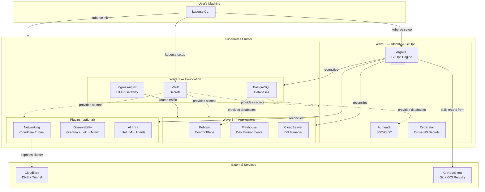
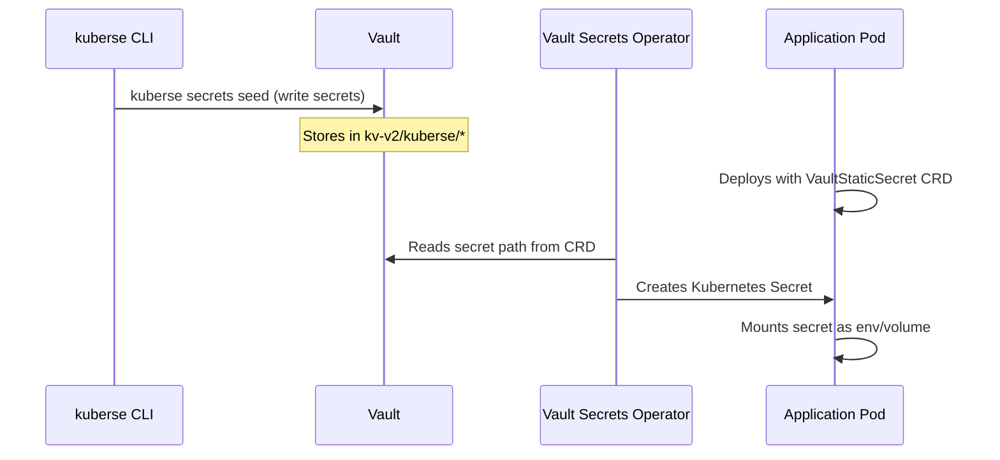
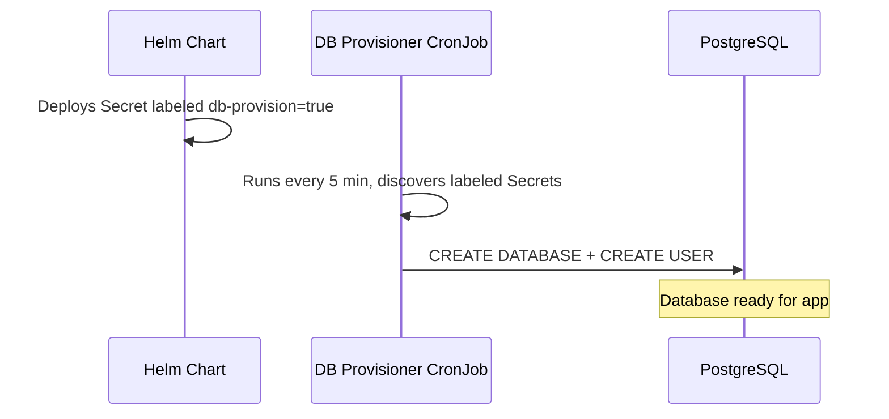
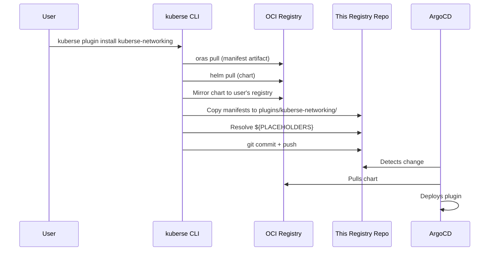

# Platform Architecture

## Overview

Kuberse is a **GitOps-first Kubernetes platform** that packages production infrastructure into a forkable template. The platform follows a layered architecture where each layer depends only on the layers below it.



## Design Principles

1. **Vault-first** — Vault is deployed and seeded by the CLI *before* ArgoCD exists. This eliminates secret race conditions. Every other component pulls secrets via `VaultStaticSecret` CRDs.

2. **Umbrella chart pattern** — One OCI Helm chart per category (platform, runners, buildapp) with all subcharts disabled by default. Each ArgoCD Application enables exactly one subchart. This means adding a service requires zero chart changes — only a new ArgoCD Application manifest in this repo.

3. **Three-level app-of-apps** — `bootstrap.yaml` → category app-of-apps → individual Applications. ArgoCD auto-discovers new services by scanning directories.

4. **Template-driven personalization** — All manifests use `${PLACEHOLDER}` tokens that the CLI resolves during setup. After resolution, the repo contains valid YAML that ArgoCD can apply directly.

5. **Plugin extensibility** — New capabilities ship as OCI artifacts (chart + manifests). The CLI mirrors them to the user's registry and injects resolved manifests into this repo. ArgoCD does the rest.

## Data Flows

### Secret Provisioning



### Database Auto-Provisioning



### Plugin Installation



## Network Topology

```
Internet
  │
  ├─ Cloudflare DNS (*.your-domain.com)
  │     │
  │     ▼
  ├─ Cloudflare Tunnel (outbound-only from cluster)
  │     │
  │     ▼
  └─ ingress-nginx (in-cluster L7 router)
        │
        ├─ argocd.your-domain.com    → ArgoCD Server
        ├─ vault.your-domain.com     → Vault UI
        ├─ auth.your-domain.com      → Authentik
        ├─ kubrain.your-domain.com   → Kubrain App
        ├─ grafana.your-domain.com   → Grafana (plugin)
        └─ *.your-domain.com         → Other services
```

## Technology Stack

| Layer | Technology | Why |
|-------|-----------|-----|
| Secrets | HashiCorp Vault (HA Raft) | Zero-trust, dynamic credentials, audit log |
| GitOps | ArgoCD | Declarative, auto-sync, health checks, RBAC |
| Identity | Authentik | Full OIDC provider, self-hosted, SCIM |
| Database | PostgreSQL (HA) | Reliable, auto-provisioned per service |
| Ingress | ingress-nginx | Industry standard, annotation-driven |
| Tunnel | Cloudflare Tunnel | No open ports, DDoS protection, Zero Trust |
| Monitoring | Grafana + Loki + Mimir | Unified logs/metrics, lightweight |
| Charts | Helm + OCI | Versioned, reproducible, registry-native |
| CI | GitHub Actions | Native, with self-hosted runners in-cluster |
