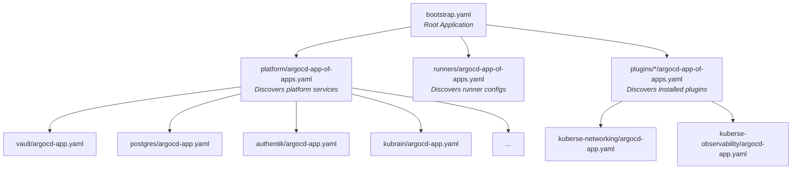
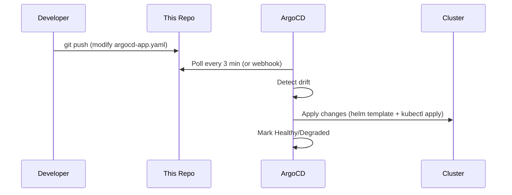

# GitOps Flow

## The Single Source of Truth

This repository **is** the cluster state. ArgoCD continuously reconciles what's in this repo with what's running in the cluster. If you want to change the cluster, you change this repo.

## Three-Level App-of-Apps

ArgoCD uses a hierarchical discovery pattern to find and deploy all services:



### Level 1: bootstrap.yaml

The root Application. Created by `kuberse setup` as the final step. It points at this repo's root and uses **directory-based auto-discovery** to find all `argocd-app-of-apps.yaml` files.

### Level 2: App-of-Apps

Each category (platform, runners, plugins) has one `argocd-app-of-apps.yaml` that scans its directory for subdirectories containing `argocd-app.yaml` files.

### Level 3: Individual Applications

Each service has its own `argocd-app.yaml` that points at an OCI Helm chart and enables exactly one subchart:

```yaml
# platform/vault/argocd-app.yaml (simplified)
apiVersion: argoproj.io/v1alpha1
kind: Application
metadata:
  name: vault
  annotations:
    argocd.argoproj.io/sync-wave: "1"
spec:
  source:
    repoURL: ${REGISTRY_URL}/${ORG_NAME}/charts/platform
    targetRevision: ${PLATFORM_VERSION}
    helm:
      values: |
        vault:
          enabled: true
  destination:
    namespace: platform
  syncPolicy:
    automated:
      selfHeal: true
    syncOptions:
      - CreateNamespace=true
      - ServerSideApply=true
```

## Sync Waves

ArgoCD deploys services in a specific order using sync wave annotations:

| Wave | What deploys | Why this order |
|------|-------------|----------------|
| -1 | Namespaces | Must exist before anything else |
| 0 | kubernetes-replicator | Secrets need cross-namespace replication |
| 1 | Vault, PostgreSQL, ingress-nginx | Foundation services (no dependencies) |
| 2 | Authentik, ArgoCD config | Depends on Vault (secrets) and PG (database) |
| 3 | Kubrain, Playhouse, CloudBeaver | Depends on identity + secrets |
| 4 | Plugins (networking, observability, AI) | Depends on full platform |

## How Changes Propagate



**Auto-sync is enabled** — ArgoCD applies changes automatically without manual approval. Self-heal is also enabled, meaning manual cluster changes get reverted.

## Adding a New Service

To deploy a new service without touching any Helm chart:

1. Create a directory under `platform/` (e.g., `platform/my-service/`)
2. Add an `argocd-app.yaml` pointing at an existing umbrella chart with your subchart enabled
3. Commit and push
4. ArgoCD discovers and deploys it automatically

This is the power of the umbrella chart pattern — the chart already contains all subcharts (disabled). You just toggle them on per-Application.

## Recovery

Since this repo is the source of truth:

- **Cluster dies?** → Re-run `kuberse init` + `kuberse setup` pointing at the same fork. ArgoCD redeploys everything.
- **Service broken?** → `git revert` the commit. ArgoCD rolls back.
- **Want to test?** → Create a branch, change `targetRevision`, push. ArgoCD deploys the branch version.
