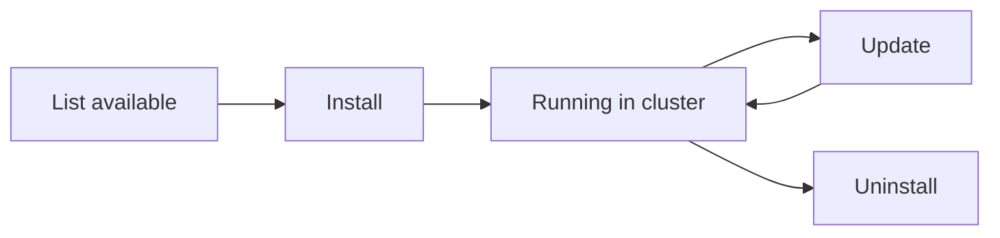

# Plugin System

## What Are Plugins?

Plugins extend the Kuberse platform with new capabilities. They are self-contained packages distributed as OCI artifacts that the CLI installs into your registry repo. ArgoCD then deploys them like any other component.

**First-party plugins:**

| Plugin | What it adds |
|--------|-------------|
| `kuberse-networking` | Cloudflare Tunnel — secure public access without open ports |
| `kuberse-observability` | Grafana + Loki + Mimir — dashboards, logs, and metrics |
| `kuberse-ai` | LiteLLM + LangGraph agents — AI infrastructure |

## Plugin Lifecycle



### Install

```bash
kuberse plugin install oci://ghcr.io/marioapgs/kuberse-networking-plugin:latest
```

The install command is **idempotent**: if the plugin is already installed at the same version, it skips. If a different version is detected, it auto-updates. Use `--no-seed` to skip Vault seeding.

What happens:
1. CLI pulls the plugin's OCI manifest artifact
2. CLI pulls the Helm chart
3. Chart is mirrored to your OCI registry
4. Manifest files (ArgoCD apps, Backstage entities) are copied to `plugins/<name>/`
5. Placeholders are resolved
6. Changes are committed and pushed
7. ArgoCD detects new Applications and deploys the plugin

### Update

```bash
kuberse plugin update kuberse-networking
```

Pulls the latest version, mirrors the new chart, updates `${KUBERSE_NETWORKING_VERSION}` in manifests, commits.

### Uninstall

```bash
kuberse plugin uninstall kuberse-networking
```

Removes the `plugins/<name>/` directory and commits. ArgoCD prunes the resources.

### Status

```bash
kuberse plugin status
# Shows installed plugins, versions, and ArgoCD sync state
```

## Plugin Anatomy

Every plugin repository follows this structure:

```
kuberse-networking/
├── src/
│   └── kuberse-networking/
│       └── chart/              # Helm umbrella chart
│           ├── Chart.yaml
│           ├── charts/         # Subcharts (the actual workloads)
│           └── values.yaml
├── template/                   # OCI manifest artifact contents
│   ├── plugin.yaml             # Plugin descriptor (apiVersion: kuberse.io/v1)
│   ├── argocd-app-of-apps.yaml # Plugin-level app-of-apps (required name)
│   ├── cloudflare-tunnel/      # One directory per subchart/component
│   │   ├── argocd-app.yaml     # ArgoCD Application for this component
│   │   └── catalog-info.yaml   # Optional Backstage entity
│   └── docs/                   # Plugin documentation (installed with plugin)
│       └── README.md
└── README.md
```

> **Note:** This is the **colocated format** — each component has its own directory containing both `argocd-app.yaml` and optional `catalog-info.yaml`. The old split format (`argocd/` + `backstage/` subdirectories) is deprecated.

### plugin.yaml

The plugin descriptor defines metadata and requirements:

```yaml
apiVersion: kuberse.io/v1
kind: Plugin
metadata:
  name: kuberse-networking
  version: 1.0.0
  description: "Cloudflare Tunnel networking for Kuberse"
  author: MarioAPGS
spec:
  manifests:
    argocd: "."

  artifacts:
    images: []
    charts:
      - oci://ghcr.io/marioapgs/kuberse-networking-plugin/charts/kuberse-networking:latest

  placeholders:
    - REGISTRY_URL
    - GIT_BASE_URL
    - ORG_NAME
    - BASE_DOMAIN
```

The `spec.placeholders` list declares which tokens appear in the plugin's manifests:
- **If the value exists in the platform config** → resolved automatically (no prompt)
- **If the value is NOT in config** → user is prompted at install time, and the value is **persisted** to `kuberse-config` for future use

## How Plugins Integrate

Plugins use the same patterns as platform components:

- **Secrets** → `VaultStaticSecret` CRDs (secrets must be seeded first via `kuberse secrets seed`)
- **Databases** → Labeled Secrets for auto-provisioning
- **Ingress** → Standard Ingress resources with `${BASE_DOMAIN}` annotations
- **SSO** → Authentik OIDC providers (pre-configured by the plugin chart)

## Authoring a Plugin

See the comprehensive [Plugin Authoring Guide](../../plugins/docs/plugins.md) for:
- Step-by-step creation from `_template/`
- CI/CD pipeline setup
- OCI publishing workflow
- Versioning strategy
- Validation rules and common pitfalls

## Installed Plugin Directory

After installation, plugins live at:

```
plugins/
├── kuberse-networking/
│   ├── argocd-app-of-apps.yaml
│   ├── cloudflare-tunnel/
│   │   └── argocd-app.yaml
│   └── docs/
│       └── README.md
├── kuberse-observability/
│   ├── argocd-app-of-apps.yaml
│   ├── grafana/argocd-app.yaml
│   ├── logs/argocd-app.yaml
│   ├── metrics/argocd-app.yaml
│   └── docs/
│       └── README.md
└── kuberse-ai/
    ├── argocd-app-of-apps.yaml
    ├── ...
    └── docs/
        └── README.md
```

ArgoCD discovers these via `bootstrap.yaml`'s recursive directory scan.

> **Note:** Each plugin ships its own documentation in `template/docs/`. After installation, find plugin-specific docs at `plugins/<name>/docs/`.
