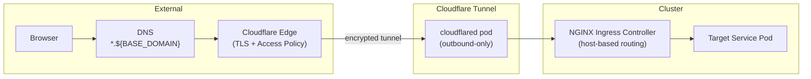
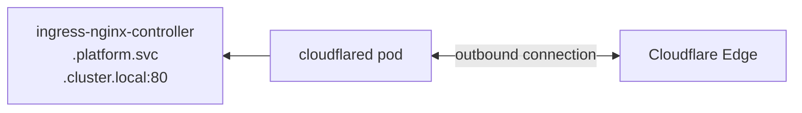
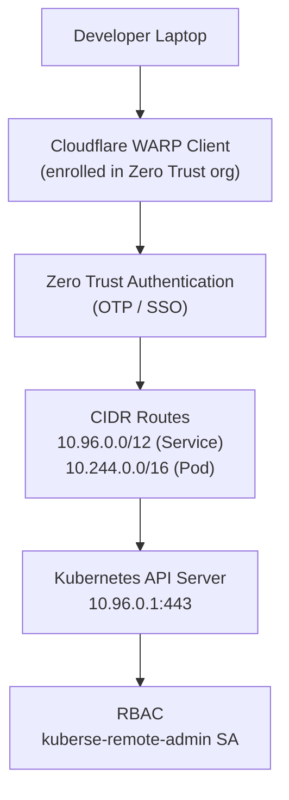

# Networking Model

This document explains how network traffic flows through the Kuberse platform -- from external user requests to internal pod communication, including the zero-trust security model and remote cluster access.

> **Note:** The Cloudflare Tunnel component (`cloudflared` pods in the `networking` namespace) is deployed via the [kuberse-networking plugin](../../../plugins/docs/plugins.md). Its configuration (tunnel credentials, public hostname mappings) is managed through that plugin's Helm values. This document describes the overall architecture; see the networking plugin for operational details.

## Traffic Flow Overview

Kuberse uses a **zero-trust networking model** where no ports are exposed to the public Internet. All external traffic flows through Cloudflare's global network, authenticated and encrypted before reaching the cluster.



## Layer 1: Cloudflare DNS

All public services are exposed under the `${BASE_DOMAIN}` domain. A wildcard CNAME record (`*.${BASE_DOMAIN}`) points to the Cloudflare Tunnel:

```
*.${BASE_DOMAIN} → CNAME → <tunnel-id>.cfargotunnel.com
```

| Subdomain | Service |
|-----------|---------|
| `vault.${BASE_DOMAIN}` | Vault UI |
| `argocd.${BASE_DOMAIN}` | ArgoCD UI |
| `kiops.${BASE_DOMAIN}` | Kiops developer portal |
| `api.${BASE_DOMAIN}` | Kuberse REST API |
| `cloudbeaver.${BASE_DOMAIN}` | CloudBeaver web DB client |
| `{ns}-code.${BASE_DOMAIN}` | code-server (VS Code web IDE) per BuildApp lab |

> code-server uses single-level subdomains (`{ns}-code.${BASE_DOMAIN}`) covered by the existing `*.${BASE_DOMAIN}` wildcard. No separate DNS record is needed.

## Layer 2: Cloudflare Zero Trust

Before traffic reaches the cluster, Cloudflare enforces authentication and authorization:

1. **Access Application**: A wildcard self-hosted application (`*.${BASE_DOMAIN}`) requires authentication for all requests
2. **Identity Providers**: OTP (email), Google OAuth, or GitHub OAuth
3. **Access Policy**: Only allowed email addresses or email domains can access the platform
4. **Session Duration**: Configurable (default 24 hours) -- users re-authenticate after expiry

## Layer 3: Cloudflare Tunnel

The `cloudflared` daemon runs as a 2-replica Deployment in the `networking` namespace. It establishes **outbound-only** connections to Cloudflare's edge network -- no inbound ports are opened on the cluster or the host network.



### Public Hostname Configuration

Each public service is mapped to the internal NGINX Ingress Controller:

```yaml
publicHostnames:
  - hostname: vault.${BASE_DOMAIN}
    service: http://ingress-nginx-controller.platform.svc.cluster.local:80
    originRequest:
      httpHostHeader: vault.${BASE_DOMAIN}
      noTLSVerify: true
```

The `httpHostHeader` ensures NGINX routes the request to the correct Ingress resource based on the `Host` header. `noTLSVerify` is set because TLS is terminated at Cloudflare Edge.

### High Availability

- 2 replicas of `cloudflared` for redundancy
- Pod anti-affinity spreads replicas across nodes
- Init containers ensure both Vault (for the tunnel token) and NGINX are ready before cloudflared starts

## Layer 4: NGINX Ingress Controller

The NGINX Ingress Controller is the internal HTTP router. It receives traffic from `cloudflared` and routes it to the correct backend service based on the `Host` header.

### NodePort Configuration

```
HTTP:  → NodePort 30080 → Ingress Controller → Service pods
HTTPS: → NodePort 30443 → Ingress Controller → Service pods
```

NodePorts are primarily used for local development access. In production, all external traffic comes through the Cloudflare Tunnel.

### Ingress Resources

Each module that needs HTTP exposure creates its own Ingress resource:

| Module | Host | Backend |
|--------|------|---------|
| Vault | `vault.${BASE_DOMAIN}` | `vault.platform:8200` |
| ArgoCD | `argocd.${BASE_DOMAIN}` | `argocd-server.argocd:443` (HTTPS backend) |
| Kiops | `kiops.${BASE_DOMAIN}` | `kiops.platform:7007` |
| Kuberse API | `api.${BASE_DOMAIN}` | `kuberse-api-service.platform:8000` |
| CloudBeaver | `cloudbeaver.${BASE_DOMAIN}` | `cloudbeaver.platform:8978` |
| BuildApp code-server | `{namespace}-code.${BASE_DOMAIN}` | `{labName}-code-server.{namespace}:8080` |

## Remote kubectl Access

Kuberse provides secure remote `kubectl` access through Cloudflare WARP without exposing the Kubernetes API to the Internet.

### Architecture



### Security Layers

| Layer | Component | What It Protects |
|-------|-----------|-----------------|
| 1 | WARP enrollment | Only authorized devices can connect |
| 2 | Zero Trust auth | User must authenticate (OTP, Google, GitHub) |
| 3 | CIDR routing | Only routed traffic reaches the cluster network |
| 4 | Kubernetes RBAC | ServiceAccount permissions control API access |
| 5 | Token secret | Revocable by deleting the Kubernetes Secret |

## Internal Service Communication

Within the cluster, services communicate through standard Kubernetes DNS:

```
<service-name>.<namespace>.svc.cluster.local:<port>
```

Examples:
- `vault.platform.svc.cluster.local:8200` -- Vault API
- `kuberse-api-service.platform.svc.cluster.local:8000` -- Kuberse API
- `ingress-nginx-controller.platform.svc.cluster.local:80` -- NGINX

### BuildApp Service DNS

Within a BuildApp lab namespace, services follow the pattern:

```
<labName>-<serviceName>.<namespace>.svc.cluster.local:<port>
```

Example for a lab named `mylab` in namespace `buildapp-mylab`:
- `mylab-postgres.buildapp-mylab.svc.cluster.local:5432`
- `mylab-redis.buildapp-mylab.svc.cluster.local:6379`
- `mylab-dev.buildapp-mylab.svc.cluster.local:22` (SSH)
- `mylab-code-server.buildapp-mylab.svc.cluster.local:8080` (code-server)

## Network Policies

> **Known limitation**: The platform does not currently enforce Kubernetes NetworkPolicies. This is a deliberate trade-off for the initial deployment -- the platform prioritizes bootstrap simplicity and relies on other isolation mechanisms.

Network isolation is currently achieved through:

1. **Namespace boundaries** -- logical separation of concerns
2. **Vault RBAC** -- each module can only access its own secrets
3. **Cloudflare Zero Trust** -- external access is gated at the edge
4. **No public IPs** -- no services are directly exposed to the Internet

### Future: Planned NetworkPolicy Scope

When implemented, NetworkPolicies will:
- Restrict inter-namespace traffic to explicitly declared dependencies
- Isolate BuildApp lab namespaces from each other and from platform services
- Allow only `networking` namespace pods to receive traffic from Cloudflare Tunnel
