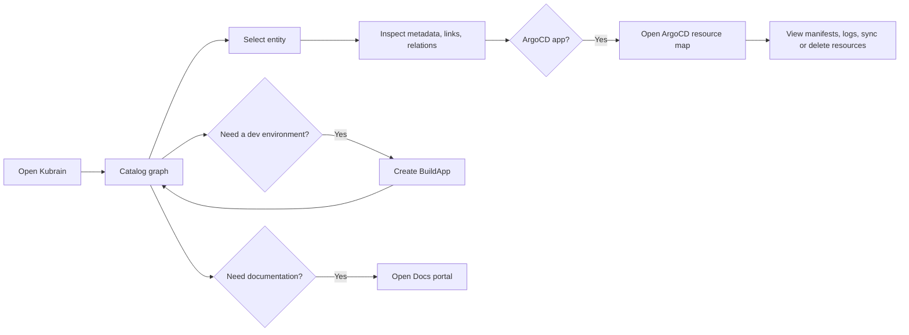

# Kubrain

> Kubrain is the Kuberse control plane UI: a visual catalog, BuildApp launcher, live ArgoCD resource explorer, and documentation portal.

| Property | Value |
|----------|-------|
| **URL** | `https://kubrain.kuberse.net` |
| **Main Route** | `/nodes` |
| **User Features** | Catalog graph, ArgoCD resources, BuildApp creation/editing, docs portal |
| **Authentication** | External OIDC Authorization Code + PKCE; local permissions |

## What You Can Do

Kubrain gives platform users a single place to understand and operate the Kuberse platform:

| Feature | Route | What it is for |
|---------|-------|----------------|
| **Catalog** | `/nodes` | Explore systems, apps, resources, users, groups, and their relationships as an interactive graph |
| **ArgoCD Resources** | `/nodes/argocd?app=<app>` | Inspect live Kubernetes resources for an ArgoCD application, including health, sync status, manifests, logs, and actions |
| **BuildApps** | `/buildapp` | Create development environments from JSON values and manage existing BuildApps from the catalog |
| **Docs Portal** | `/docs` | Browse markdown documentation registered as `kind: Doc` catalog entities |

## Recommended First Steps

1. Open `https://kubrain.kuberse.net`.
2. Use the sidebar menu to switch between Catalog, BuildApp, and Docs.
3. Start in **Catalog** to understand what is deployed and how things relate.
4. Select an entity to open its details panel.
5. For entities connected to ArgoCD, open **ArgoCD Resources** to inspect live Kubernetes objects.

## Core Workflow

## Authentication

Kubrain loads public `/api/v1/auth/config` and presents one login option per
configured external OIDC provider. The browser uses Authorization Code + PKCE,
then sends the JWT access token on protected API calls. The profile control
shows the effective identity and permissions and provides local logout.

Authorization is local to Kubrain: a first-time OIDC identity has no permissions
until an operator grants them. Kubrain does not derive permissions from token
groups. With no providers configured, Kubrain instead uses the reserved
anonymous system administrator; this is not guest access.

Cloudflare Access can still protect the ingress as an additional outer layer,
but it does not replace Kubrain's own OIDC and permission checks.

See the platform [Kubrain authentication guide](../../../docs/platform/kubrain.md).

## Screenshots

The screenshots in this documentation show representative UI sections. They are intentionally cropped to focus on the relevant controls instead of full-page captures.

## Related Guides

- [Using the Catalog](catalog/overview.md)
- [ArgoCD Resources](catalog/argocd-resources.md)
- [Creating BuildApps](buildapps/create-buildapp.md)
- [BuildApp Agent Gateway](buildapps/agent-gateway.md)
- [Using the Docs Portal](docs-portal/overview.md)
- [Routes Reference](reference/routes.md)
