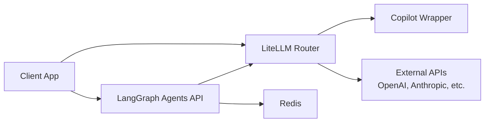

# AI Infrastructure Plugin — kuberse-ai

## Overview

The AI plugin deploys infrastructure for running LLM-powered services: an OpenAI-compatible API router, a multi-agent orchestration engine, and supporting services (Redis, model routing).

## What It Deploys

| Component | Description |
|-----------|-------------|
| **LiteLLM** | OpenAI-compatible API router — unified endpoint for multiple LLM providers |
| **Copilot Wrapper** | Proxy that exposes GitHub Copilot CLI as an OpenAI-compatible API |
| **LangGraph Agents** | Multi-agent orchestration API (FastAPI + LangGraph) |
| **Redis** | Shared cache and message broker for agent state |

## Architecture



## Installation

```bash
# Install the plugin (placeholders resolved automatically from platform config)
kuberse plugin install oci://ghcr.io/marioapgs/kuberse-ai-plugin:latest

# Seed required secrets
kuberse secrets seed
# Prompts for: GitHub Copilot token, optional external API keys
```

## Required Secrets

Secrets are seeded into Vault from `secrets-expected.json` via `kuberse secrets seed`. The
agents service reads the entire secret at `secret/kuberse-agents/config` (KV-v2) via the Vault
Secrets Operator and mounts it as environment variables.

| Vault Path | Key | Description |
|-----------|-----|-------------|
| `secret/kuberse-agents/config` | `LLM_API_KEY` | API key for the LLM provider (prompted at seed time) |
| `secret/kuberse-agents/config` | `LLM_PROVIDER` | LLM provider name (e.g. `deepseek`) |
| `secret/kuberse-agents/config` | `LLM_MODEL` | Model name (e.g. `deepseek-v4-flash`) |
| `secret/kuberse-agents/config` | `OPENCODE_MODEL` | OpenCode model identifier (e.g. `opencode/big-pickle`) |
| `secret/kuberse-agents/config` | `PG_CONNECTION_STRING` | PostgreSQL connection string for the agents database |
| `secret/kuberse-agents/config` | `KUBRAIN_URL` | Kubrain service URL |
| `secret/kuberse-agents/config` | `CHECKPOINTER_BACKEND` | LangGraph checkpointer backend (`memory` or `postgres`) |

### Vault wiring

Each chart in this plugin is self-contained per the platform Vault contract. The
`kuberse-agents` chart owns the shared `VaultConnection` named `vault-connection` in the
`ai-infra` namespace (controlled by `vault.manageConnection`, default `true`), so the plugin
syncs secrets without depending on the optional `postgres-ai` chart. The chart also ships a
`vault-role-configmap` labeled `vault: setup-creds`, which the platform's `vault-module-config`
CronJob discovers to create the `kuberse-agents-role` Kubernetes-auth role and
`kuberse-agents-policy` in Vault.

## Usage

After installation, all platform services can use AI via the LiteLLM endpoint:

```bash
# OpenAI-compatible endpoint available cluster-wide
curl http://litellm.ai-infra.svc.cluster.local:4000/v1/chat/completions \
  -H "Content-Type: application/json" \
  -d '{"model": "copilot", "messages": [{"role": "user", "content": "Hello"}]}'
```

The LangGraph agents API provides higher-level orchestration:

```bash
curl http://kuberse-agents.ai-infra.svc.cluster.local:8080/api/v1/invoke \
  -H "Content-Type: application/json" \
  -d '{"agent": "research", "input": "Summarize cluster health"}'
```

## Model Routing

LiteLLM routes requests based on the `model` field:

| Model name | Routes to |
|-----------|-----------|
| `copilot` | Copilot Wrapper (free with GitHub Copilot subscription) |
| `gpt-4o` | OpenAI API (requires API key) |
| `claude-sonnet-4-20250514` | Anthropic API (requires API key) |

Configure routing in the chart values — no code changes needed.
