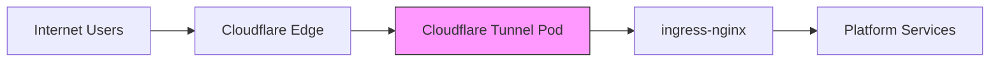

# Networking Plugin — kuberse-networking

## Overview

The networking plugin provides **secure public access** to your cluster without opening any inbound ports. It uses Cloudflare Tunnel to establish an outbound-only connection from your cluster to Cloudflare's edge network.

## What It Deploys

| Component | Description |
|-----------|-------------|
| **Cloudflare Tunnel** | Daemon that connects your cluster to Cloudflare (outbound-only) |
| **Cloudflare Terraform** | Automates DNS records, Access policies, and tunnel configuration |

## Architecture



**Key properties:**
- No inbound ports open on your cluster
- DDoS protection via Cloudflare
- Zero Trust access policies (optional)
- Automatic TLS termination at Cloudflare edge
- HA mode (multiple tunnel replicas)

## Installation

```bash
kuberse plugin install oci://ghcr.io/marioapgs/kuberse-networking-plugin:latest
```

The install command resolves all `${PLACEHOLDER}` tokens automatically from your platform config:
- `${REGISTRY_URL}`, `${ORG_NAME}` — OCI chart source
- `${BASE_DOMAIN}` — ingress hosts
- `${KUBERSE_NETWORKING_VERSION}` — chart version (auto-resolved from OCI mirror)

After install, seed the required Cloudflare secret:

```bash
kuberse secrets seed
# Prompts for: Cloudflare Tunnel token
```

## Required Secrets

| Vault Path | Key | How to get it |
|-----------|-----|---------------|
| `kuberse/cloudflare` | `tunnel-token` | Cloudflare Zero Trust dashboard → Tunnels → Create → Copy token |

## DNS Configuration

After installation, configure your domain's DNS in Cloudflare:

1. Add your domain to Cloudflare (nameserver delegation)
2. The Terraform component creates CNAME records: `*.your-domain.com → <tunnel-id>.cfargotunnel.com`
3. All services become accessible at `<service>.your-domain.com`

## Configuration

The plugin uses defaults that work for most setups. To customize, edit `plugins/kuberse-networking/cloudflare-tunnel/argocd-app.yaml`:

```yaml
helm:
  values: |
    cloudflare-tunnel:
      enabled: true
      replicas: 2          # HA mode
      resources:
        requests:
          memory: 128Mi
```

## Placeholders Used

This plugin's manifests use these tokens (all resolved automatically by the CLI):

| Token | Purpose |
|-------|---------|
| `${REGISTRY_URL}` | OCI chart registry host |
| `${ORG_NAME}` | Organization in the registry |
| `${GIT_BASE_URL}` | Git source for app-of-apps |
| `${BASE_DOMAIN}` | Ingress hosts |
| `${KUBERSE_NETWORKING_VERSION}` | Chart version pinning |
